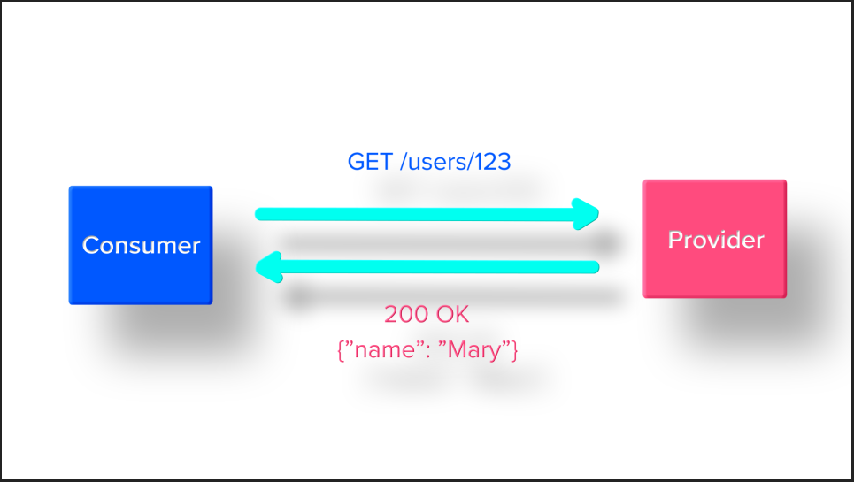
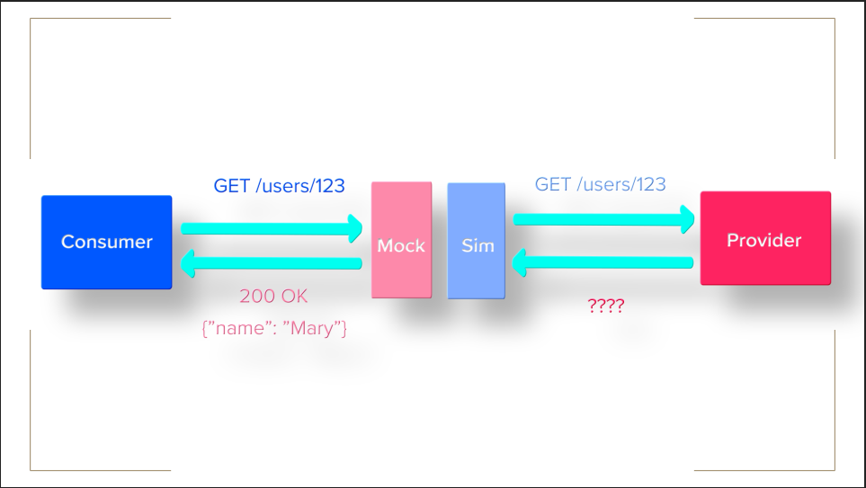
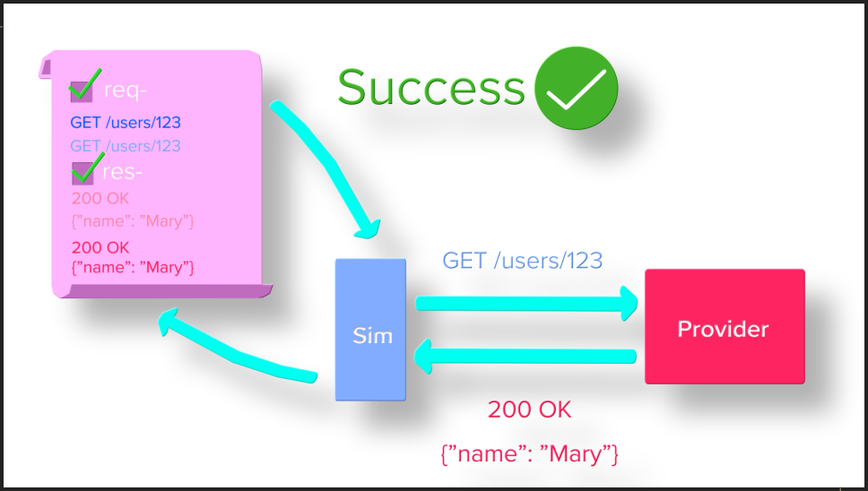

# The problem with integrated tests

Before we deploy an application to production, we need to make sure that it works correctly with the other applications with which it integrates. To do this, traditionally we use end to end integration tests.

E2E tests give us

✅ confidence to deploy

but

❌introduce dependencies 
❌are slow 
❌break easily 
❌require lots of maintenance 

# Why not use isolated tests?

By testing each side of an integration point using a mock or simulated version of the other application, we get two sets of tests which:

✅ can be run independently 
✅ are fast 
✅ stable 
✅ easy to maintain 

but

❌do not give us confidence to deploy.

This is because there is nothing to ensure that the behaviour of the simulated applications accurately reflects reality.

# How Pact helps - the consumer side

Pact solves the problem of keeping the two sets of tests in sync by use of a "contract", also known as a “pact”.

During the execution of the consumer tests, each request that is made to the mock provider is recorded into the pact file, along with its expected response.

# How Pact helps - the provider side

The pact file is then taken over to the provider project. Each request is replayed against the real provider, and the actual response is compared to the expected response. If they match, we have proven that the simulated applications behave the same way as the real applications. This means that when these two applications interact in real life, they should work together correctly.

Using Pact gives you tests that:

✅ can be run independently 
✅ are fast 
✅ stable 
✅ easy to maintain 

and

✅ give you confidence to deploy
